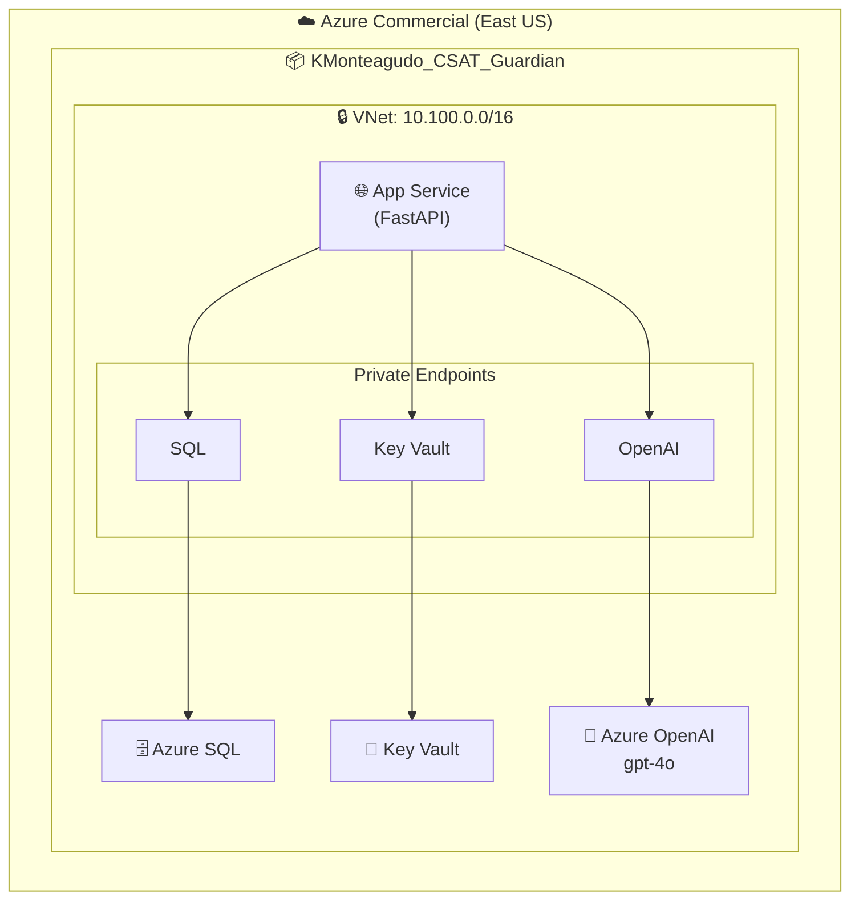
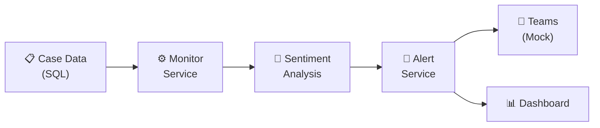

# CSAT Guardian

> **Customer Satisfaction Guardian** - Proactive CSAT Risk Detection and Intervention

## Overview

CSAT Guardian is an AI-powered system that monitors support cases to proactively identify at-risk customer satisfaction situations before they escalate.

### Key Features

| Feature | Description | Status |
|---------|-------------|--------|
| 🔍 **Sentiment Analysis** | AI-powered detection of frustrated/unhappy customer communications | ✅ Implemented |
| ⏰ **Compliance Monitoring** | Tracks 7-day case note requirements and alerts before breaches | ✅ Implemented |
| 📉 **Trend Detection** | Identifies declining sentiment patterns across case timelines | ✅ Implemented |
| 🚨 **Proactive Alerts** | Generates alerts for engineers and managers | ✅ Implemented |
| 💬 **Conversational AI** | Engineers can ask questions about their cases via chat | ✅ Implemented |
| 🔒 **Private Networking** | All backend services accessed via Private Endpoints | ✅ Deployed |
| 🌐 **FastAPI Backend** | REST API for all case/sentiment/alert operations | ✅ Implemented |
| 📱 **Teams Integration** | Bot-based alerts and chat in Teams | 🔮 Future |
| 📋 **DfM Integration** | Real case data from DfM API | 🔮 Future |

## Architecture

### Infrastructure Overview



### Data Flow



## Deployed Resources

| Resource | Name | Endpoint |
|----------|------|----------|
| **App Service** | `app-csatguardian-dev` | `.azurewebsites.net` |
| **Azure OpenAI** | `oai-csatguardian-dev` | `.openai.azure.com` |
| **SQL Server** | `sql-csatguardian-dev` | `.database.windows.net` |
| **Key Vault** | `kv-csatguardian-dev` | `.vault.azure.net` |
| **VNet** | `vnet-csatguardian-dev` | 10.100.0.0/16 |

## Quick Links

| Document | Description |
|----------|-------------|
| [Deployment Guide](infrastructure/DEPLOYMENT_GUIDE.md) | Step-by-step deployment instructions |
| [Project Plan](docs/PROJECT_PLAN.md) | SDLC methodology, branching strategy |
| [Architecture](docs/ARCHITECTURE.md) | System design |
| [File Reference](docs/FILE_REFERENCE.md) | Cheat sheet for all files |

## Getting Started

### Prerequisites

- Python 3.11+
- Azure CLI: `az login`
- Git

### Local Development

1. **Clone and navigate to the project**:
   ```bash
   cd csat-guardian
   ```

2. **Create and activate virtual environment**:
   ```bash
   python -m venv env
   env\Scripts\activate  # Windows
   source env/bin/activate  # macOS/Linux
   ```

3. **Install dependencies**:
   ```bash
   pip install -r requirements.txt
   ```

4. **Configure environment**:
   ```bash
   cp .env.example .env.local
   # Edit .env.local with your Azure credentials
   ```

5. **Run the API server**:
   ```bash
   cd src
   python -m uvicorn api:app --host 0.0.0.0 --port 8000
   ```

6. **Access the API**:
   - Swagger docs: http://localhost:8000/docs
   - Health check: http://localhost:8000/api/health

### Deployment to Azure

See [Deployment Guide](infrastructure/DEPLOYMENT_GUIDE.md) for full instructions.

Quick deployment:
```powershell
cd infrastructure
.\deploy-all.ps1 -SqlPassword "YourSecurePassword123!"
```

## API Endpoints

| Endpoint | Method | Description |
|----------|--------|-------------|
| `/` | GET | API info |
| `/api/health` | GET | Health check with service status |
| `/api/engineers` | GET | List all engineers |
| `/api/cases` | GET | List cases (with optional filters) |
| `/api/cases/{id}` | GET | Get case details with timeline |
| `/api/analyze/{id}` | POST | Run sentiment analysis |
| `/api/chat` | POST | Chat with the Guardian agent |
| `/api/alerts` | GET | List active alerts |

## Project Structure

```
csat-guardian/
├── .github/workflows/      # CI pipeline
├── docs/                   # Documentation
├── infrastructure/
│   ├── bicep/              # Azure IaC
│   │   └── main-commercial.bicep
│   ├── deploy-all.ps1      # One-click deployment script
│   └── DEPLOYMENT_GUIDE.md
├── scripts/                # Utility scripts
├── src/
│   ├── api.py              # FastAPI REST backend
│   ├── db_sync.py          # Azure SQL client
│   ├── config.py           # Configuration
│   ├── models.py           # Data models
│   ├── agent/              # Conversational AI
│   ├── clients/            # External service clients
│   └── services/           # Business logic
├── requirements.txt
└── README.md
```

## Sample Data

The POC includes 6 test cases:

| Case ID | Scenario | Expected Alerts |
|---------|----------|-----------------|
| case-001 | Happy Customer | None |
| case-002 | Frustrated Customer | Negative sentiment |
| case-003 | Neutral Customer | None |
| case-004 | Declining Sentiment | Trend + 7-day breach |
| case-005 | 7-Day Warning | Compliance warning |
| case-006 | 7-Day Breach | Compliance breach |

## License

Internal Microsoft Use Only

## Support

Contact: CSS Escalations Team
