# CSAT Guardian

> **Customer Satisfaction Guardian** - Proactive CSAT Risk Detection and Intervention

## Overview

CSAT Guardian is an AI-powered system that monitors support cases to proactively identify at-risk customer satisfaction situations before they escalate.

> **⚠️ Azure Government Cloud with Private Networking**
> 
> This application is deployed in **Azure Government** with **private endpoints**.  
> All Azure-to-Azure communication is private (no public internet exposure).
> See [Azure Government docs](docs/AZURE_GOVERNMENT.md).

### Key Features

| Feature | Description | Status |
|---------|-------------|--------|
| 🔍 **Sentiment Analysis** | AI-powered detection of frustrated/unhappy customer communications | ✅ Implemented |
| ⏰ **Compliance Monitoring** | Tracks 7-day case note requirements and alerts before breaches | ✅ Implemented |
| 📉 **Trend Detection** | Identifies declining sentiment patterns across case timelines | ✅ Implemented |
| 🚨 **Proactive Alerts** | Generates alerts for engineers and managers | ✅ Implemented |
| 💬 **Conversational AI** | Engineers can ask questions about their cases via chat | ✅ Implemented |
| 🔒 **Private Networking** | All backend services accessed via Private Endpoints | ✅ Deployed |
| 🖥️ **Streamlit Dashboard** | Web UI for case overview and chat | ⏳ Next Sprint |
| 📱 **Teams Integration** | Bot-based alerts and chat in Teams | 🔮 Future (pending API approval) |
| 📋 **DfM Integration** | Real case data from DfM API | 🔮 Future (pending API approval) |

## Architecture Principles

| Principle | Implementation |
|-----------|----------------|
| **Azure Government** | All components run in Azure Gov cloud |
| **Private by Default** | VNet + Private Endpoints for all services |
| **No Secrets in Code** | Azure Key Vault for all credentials |
| **Infrastructure as Code** | Bicep templates for all Azure resources |
| **CI/CD Automation** | GitHub Actions with Gov environment |
| **FedRAMP Compliant** | Azure Government meets federal requirements |

## Deployed Resources

| Resource | Name | Purpose |
|----------|------|---------|
| **App Service** | `app-csatguardian-dev.azurewebsites.us` | Streamlit POC UI |
| **Azure OpenAI** | `oai-csatguardian-dev.openai.azure.us` | Sentiment analysis (gpt-4o) |
| **SQL Server** | `sql-csatguardian-dev.database.usgovcloudapi.net` | Case data storage |
| **Key Vault** | `kv-csatguardian-dev.vault.usgovcloudapi.net` | Secrets management |
| **VNet** | `vnet-csatguardian-dev` (10.100.0.0/16) | Private networking |

## Quick Links

| Document | Description |
|----------|-------------|
| [Project Plan](docs/PROJECT_PLAN.md) | SDLC methodology, branching strategy |
| [Architecture](docs/ARCHITECTURE.md) | System design, private networking |
| [**Infrastructure Diagrams**](docs/diagrams/infrastructure.md) | **Mermaid diagrams for security reviews** |
| [File Reference](docs/FILE_REFERENCE.md) | Cheat sheet for all files |
| [Azure Government](docs/AZURE_GOVERNMENT.md) | Gov-specific endpoints and configuration |
| [Security Review](docs/APPLICATION_SECURITY_REVIEW.md) | API approval documentation |

## Architecture

> **📊 Full diagrams available**: [docs/diagrams/infrastructure.md](docs/diagrams/infrastructure.md)

### Infrastructure Overview

```mermaid
flowchart TB
    subgraph AzureGov["🏛️ Azure Government (USGov Virginia)"]
        subgraph RG["📦 rg-csatguardian-dev"]
            subgraph VNet["🔒 VNet: 10.100.0.0/16"]
                AppService["🌐 App Service<br/>(Streamlit POC)"]
                subgraph PE["Private Endpoints"]
                    PE_SQL["SQL<br/>10.100.2.4"]
                    PE_KV["Key Vault<br/>10.100.2.5"]
                    PE_OAI["OpenAI<br/>10.100.2.6"]
                end
            end
            SQL["🗄️ Azure SQL"]
            KV["🔐 Key Vault"]
            OAI["🤖 Azure OpenAI<br/>gpt-4o"]
        end
    end

    AppService --> PE_SQL --> SQL
    AppService --> PE_KV --> KV
    AppService --> PE_OAI --> OAI
```



### Data Flow

```mermaid
flowchart LR
    A["📋 Case Data<br/>(DfM/SQL)"] --> B["⚙️ Monitor<br/>Service"]
    B --> C["🤖 Sentiment<br/>Analysis"]
    C --> D["🚨 Alert<br/>Service"]
    D --> E["💬 Teams<br/>(Mock)"]
    D --> F["📊 Dashboard"]
```



### Network Security

| Layer | Implementation | Status |
|-------|----------------|--------|
| **Network Isolation** | VNet with dedicated subnets | ✅ Deployed |
| **Private Connectivity** | Private Endpoints for all PaaS | ✅ Deployed |
| **DNS Resolution** | Private DNS Zones (Gov domains) | ✅ Deployed |
| **Secrets** | Azure Key Vault (no secrets in code) | ✅ Deployed |
| **Public Access** | Enabled for dev, disable post-deployment | ⏳ Pending |

## POC Mode

This POC runs with:
- ✅ **Real Azure OpenAI** - `oai-csatguardian-dev.openai.azure.us` (private endpoint)
- ✅ **Real Azure SQL** - `sql-csatguardian-dev.database.usgovcloudapi.net` (private endpoint)
- ✅ **Real Key Vault** - `kv-csatguardian-dev.vault.usgovcloudapi.net` (private endpoint)
- ✅ **VNet Integration** - All traffic routed through private network
- 🔄 **Mock DfM Client** - Returns sample data from Azure SQL Database
- 🔄 **Mock Teams Client** - Prints alerts to console (can send to real Teams)
- 📊 **Sample Data** - 6 test cases covering different scenarios

### Latest Test Results (Sprint 0)

```
============================================================
SCAN RESULTS SUMMARY
============================================================
  Total Cases:          6
  Negative Sentiment:   2
  Declining Sentiment:  1
  Compliance Warnings:  2
  Compliance Breaches:  2
  Alerts Sent:          7
  Errors:               0
============================================================
```

## Getting Started

### Prerequisites

- Python 3.11+
- Azure CLI configured for Government: `az cloud set --name AzureUSGovernment`
- Access to Azure Government subscription
- Git

### Installation

1. **Clone and navigate to the project**:
   ```bash
   cd csat-guardian
   ```

2. **Create and activate virtual environment**:
   ```bash
   python -m venv venv
   venv\Scripts\activate  # Windows
   source venv/bin/activate  # macOS/Linux
   ```

3. **Install dependencies**:
   ```bash
   pip install -r requirements.txt
   ```

4. **Configure environment**:
   ```bash
   cp .env.example .env.local
   # Credentials are stored in Azure Key Vault - see .env.example for details
   # Authenticate to Azure Government: az cloud set --name AzureUSGovernment && az login
   ```

5. **Test database connectivity** (optional):
   ```bash
   python scripts/test_db_connection.py
   ```

6. **Run the application**:
   ```bash
   cd src
   python main.py scan   # Run monitoring scan
   ```

## Usage

### Commands

```bash
# Run a single monitoring scan
python main.py scan

# Start continuous monitoring (every 60 minutes)
python main.py monitor

# Start continuous monitoring (custom interval)
python main.py monitor --interval 30

# Start interactive demo (Teams chat emulation)
python interactive_demo.py

# Interactive demo as specific engineer
python interactive_demo.py --engineer eng-002

# Start interactive chat (Semantic Kernel - requires debugging)
python main.py chat

# Chat as a specific engineer
python main.py chat --engineer eng-002

# Seed database (run from project root, uses Key Vault for credentials)
python scripts/seed_database.py
```

### Interactive Demo Examples

The interactive demo (`interactive_demo.py`) emulates a Teams-like chat experience:

```
============================================================
   YOUR CASES (2 total)
============================================================

  1. ✅ [case-001] Azure VM Performance Optimization
     Priority: medium | Status: active
     Last update: 3 days ago

  2. 🚨 [case-004] Billing Discrepancy Investigation
     Priority: high | Status: active
     Last update: 10 days ago (OVERDUE)

[John Smith] > 2
✓ Selected: [case-004] Billing Discrepancy Investigation
  Commands: summary, sentiment, recommendations

[John Smith] > sentiment
🎭 Analyzing sentiment with Azure OpenAI...

  😞 Overall Sentiment: NEGATIVE
  📊 Score:      0.38 (0=negative → 1=positive)
  📈 Confidence: 89%
  📉 Trend:      declining
  
  ⏰ COMPLIANCE STATUS: BREACH
     Days since last note: 10.0
```

## Project Structure

```
csat-guardian/
├── .env.example           # Environment configuration template
├── .env.local             # Local env (references Key Vault, gitignored)
├── requirements.txt       # Python dependencies
├── README.md              # This file
├── SESSION_STATE.md       # Session continuity for AI assistants
├── docs/                  # Documentation
│   ├── PROJECT_PLAN.md    # SDLC and sprint planning
│   ├── ARCHITECTURE.md    # System architecture (private networking)
│   ├── AZURE_GOVERNMENT.md # Azure Gov specifics
│   ├── FILE_REFERENCE.md  # File cheat sheet
│   ├── adr/               # Architecture Decision Records
│   └── diagrams/          # Infrastructure diagrams (Mermaid)
│       └── infrastructure.md  # Full infra diagrams for security reviews
├── infrastructure/        # Azure IaC
│   ├── bicep/
│   │   ├── main.bicep           # Original (Container Apps - superseded)
│   │   ├── main-private.bicep   # Private networking version (CURRENT)
│   │   ├── main-private.bicepparam
│   │   └── modules/
│   │       ├── networking.bicep      # VNet + Subnets
│   │       ├── private-dns.bicep     # Private DNS Zones
│   │       ├── private-endpoints.bicep # Private Endpoints
│   │       ├── openai.bicep          # Azure OpenAI
│   │       └── appservice.bicep      # App Service
│   └── scripts/
│       └── deploy-private-infra.ps1
├── scripts/               # Utility scripts
│   ├── seed_database.py   # Populate Azure SQL with sample data
│   └── test_db_connection.py
└── src/
    ├── main.py            # CLI entry point (scan, chat, monitor, setup)
    ├── interactive_demo.py # Teams-like chat emulation
    ├── config.py          # Configuration management
    ├── logger.py          # Logging setup
    ├── models.py          # Pydantic data models
    ├── database.py        # SQLAlchemy ORM
    ├── sample_data.py     # POC test data
    ├── monitor.py         # Case monitoring orchestrator
    ├── app.py             # Streamlit web UI (POC) - TODO: Not yet created
    ├── agent/
    │   └── guardian_agent.py  # Conversational AI agent (Semantic Kernel)
    ├── clients/
    │   ├── dfm_client.py      # DfM data client (mock → real pending API approval)
    │   └── teams_client.py    # Teams notification client (mock → real pending approval)
    └── services/
        ├── sentiment_service.py  # Azure OpenAI sentiment analysis
        └── alert_service.py      # Alert generation and delivery
```

## Sample Data Scenarios

The POC includes 6 test cases:

| Case ID | Scenario | Expected Behavior |
|---------|----------|-------------------|
| case-001 | Happy Customer | No alerts |
| case-002 | Frustrated Customer | Negative sentiment alert |
| case-003 | Neutral Customer | No alerts |
| case-004 | At-Risk (Declining) | Trend alert |
| case-005 | 7-Day Warning | Compliance warning alert |
| case-006 | 7-Day Breach | Compliance breach alert |

## Configuration

### Secrets Management

All secrets are stored in **Azure Key Vault** (`kv-csatguardian-dev`) accessed via **Private Endpoint**:

| Secret | Key Vault Name | Description |
|--------|----------------|-------------|
| OpenAI API Key | `AzureOpenAI--ApiKey` | Azure OpenAI authentication |
| OpenAI Endpoint | `AzureOpenAI--Endpoint` | `https://oai-csatguardian-dev.openai.azure.us/` |
| OpenAI Deployment | `AzureOpenAI--DeploymentName` | `gpt-4o` |
| SQL Connection | `SqlServer--ConnectionString` | Database connection |
| SQL Password | `SqlServer--AdminPassword` | Admin credentials |

### Private Endpoint IPs

| Service | Private IP | DNS Zone |
|---------|-----------|----------|
| SQL Server | 10.100.2.4 | privatelink.database.usgovcloudapi.net |
| Key Vault | 10.100.2.5 | privatelink.vaultcore.usgovcloudapi.net |
| Azure OpenAI | 10.100.2.6 | privatelink.openai.azure.us |

### Environment Variables

| Variable | Description | Required |
|----------|-------------|----------|
| `KEY_VAULT_NAME` | Key Vault name for secrets | Yes |
| `AZURE_OPENAI_DEPLOYMENT` | Deployment name (default: gpt-4o) | No |
| `USE_MOCK_DFM` | Use mock DfM client (default: true) | No |
| `USE_MOCK_TEAMS` | Use mock Teams client (default: true) | No |
| `LOG_LEVEL` | Logging level (default: INFO) | No |

### Alert Thresholds

```python
negative_sentiment_threshold = 0.3    # Alert if score < 0.3
trend_change_threshold = -0.2         # Alert if trend drops by 0.2
days_until_warning = 5.0              # Warn 5 days after last note
days_until_breach = 7.0               # Breach at 7 days
```

## Swapping Mock for Real Services

When DfM and Teams APIs are approved:

1. **Set environment flags**:
   ```
   USE_MOCK_DFM=false
   USE_MOCK_TEAMS=false
   ```

2. **Configure real API credentials**:
   ```
   DFM_API_BASE_URL=https://...
   TEAMS_BOT_ID=...
   ```

3. **Implement real clients** in:
   - `src/clients/dfm_client.py` → `RealDfMClient`
   - `src/clients/teams_client.py` → `RealTeamsClient`

## Security Notes

- All case access is scoped to the authenticated engineer
- No customer data is stored permanently (only analysis results)
- Azure OpenAI calls use managed identity (production)
- Teams bot requires proper AAD registration

## License

Internal Microsoft Use Only

## Support

Contact: CSS Escalations Team
