# CSAT Guardian - Infrastructure Diagrams

> **Last Updated**: February 3, 2026  
> **Purpose**: Visual documentation for stakeholder and security reviews

---

## 1. Full Infrastructure Overview

```mermaid
flowchart TB
    subgraph Internet["☁️ Internet"]
        Browser["🌐 User Browser<br/>(Frontend at /ui)"]
        DevMachine["💻 Developer Machine<br/>(Local Development)"]
    end

    subgraph AzureCommercial["☁️ Azure Commercial (Central US)"]
        subgraph RG["📦 Resource Group: CSAT_Guardian_Dev"]
            
            subgraph VNet["🔒 Virtual Network: vnet-csatguardian-dev<br/>Address Space: 10.100.0.0/16"]
                
                subgraph AppSubnet["Subnet: snet-appservice<br/>10.100.1.0/24"]
                    AppService["🌐 App Service<br/>app-csatguardian-dev<br/>(FastAPI + Static Frontend)<br/>Python 3.11 | Linux P1v3"]
                end
                
                subgraph PESubnet["Subnet: snet-privateendpoints<br/>10.100.2.0/24"]
                    PE_SQL["🔗 Private Endpoint<br/>pep-sql<br/>10.100.2.4"]
                    PE_KV["🔗 Private Endpoint<br/>pep-kv<br/>10.100.2.5"]
                    PE_OAI["🔗 Private Endpoint<br/>pep-oai<br/>10.100.2.6"]
                end
            end
            
            subgraph PaaS["PaaS Services (Private Access Only)"]
                SQL["🗄️ Azure SQL<br/>sql-csatguardian-dev<br/>.database.windows.net"]
                KV["🔐 Key Vault<br/>kv-csatguard-dev<br/>.vault.azure.net"]
                OAI["🤖 Azure OpenAI<br/>ais-csatguardian-dev<br/>.cognitiveservices.azure.com<br/>Model: gpt-4o"]
            end
            
            subgraph DNS["🌐 Private DNS Zones"]
                DNS_SQL["privatelink.database<br/>.windows.net"]
                DNS_KV["privatelink.vaultcore<br/>.azure.net"]
                DNS_OAI["privatelink.cognitiveservices<br/>.azure.com"]
            end
            
            AppInsights["📊 App Insights<br/>appi-csatguardian"]
            LogAnalytics["📋 Log Analytics<br/>log-csatguardian"]
        end
    end

    subgraph Future["🔮 Future Integration"]
        Teams["💬 Microsoft Teams<br/>(Bot Service)"]
        DfM["📋 DfM API<br/>(Case Data Source)"]
    end

    %% User connections
    Browser -->|"HTTPS<br/>/ui (Frontend)<br/>/api/* (REST)"| AppService
    
    %% Developer connections
    DevMachine -->|"az login<br/>(Public, for dev)"| KV
    DevMachine -->|"ODBC<br/>(Public, for dev)"| SQL
    DevMachine -->|"REST API<br/>(Public, for dev)"| OAI
    
    AppService -->|"VNet Integration<br/>(All outbound via VNet)"| AppSubnet
    AppService --> PE_SQL
    AppService --> PE_KV
    AppService --> PE_OAI
    
    PE_SQL -.->|"Private Link"| SQL
    PE_KV -.->|"Private Link"| KV
    PE_OAI -.->|"Private Link"| OAI
    
    DNS_SQL -.->|"A Record"| PE_SQL
    DNS_KV -.->|"A Record"| PE_KV
    DNS_OAI -.->|"A Record"| PE_OAI
    
    AppInsights --> LogAnalytics
    AppService -.->|"Telemetry"| AppInsights
    
    Teams -.->|"Future"| AppService
    DfM -.->|"Future"| AppService

    %% Styling
    classDef vnet fill:#e1f5fe,stroke:#01579b
    classDef subnet fill:#fff3e0,stroke:#e65100
    classDef pe fill:#f3e5f5,stroke:#7b1fa2
    classDef paas fill:#e8f5e9,stroke:#2e7d32
    classDef dns fill:#fce4ec,stroke:#c2185b
    classDef future fill:#f5f5f5,stroke:#9e9e9e,stroke-dasharray: 5 5
    classDef browser fill:#e3f2fd,stroke:#1565c0
    
    class VNet vnet
    class AppSubnet,PESubnet subnet
    class PE_SQL,PE_KV,PE_OAI pe
    class SQL,KV,OAI,AppService paas
    class DNS_SQL,DNS_KV,DNS_OAI dns
    class Teams,DfM future
    class Browser browser
```

> **Note**: The frontend is served directly by FastAPI at `/ui`. No separate web server required.

---

## 2. Data Flow Diagram

---

## 3. Authentication Flow

---

## 4. Network Security Flow

> **\* Note**: Public access for developers is temporary. Will be disabled post-deployment.

---

## 5. Component Inventory

| Component | Resource Name | Type | Endpoint/IP | Status |
|-----------|--------------|------|-------------|--------|
| **VNet** | vnet-csatguardian-dev | Virtual Network | 10.100.0.0/16 | ✅ Deployed |
| **App Subnet** | snet-appservice | Subnet | 10.100.1.0/24 | ✅ Deployed |
| **PE Subnet** | snet-privateendpoints | Subnet | 10.100.2.0/24 | ✅ Deployed |
| **App Service** | app-csatguardian-dev | Web App (FastAPI + Frontend) | .azurewebsites.net/ui | ✅ Running |
| **App Service Plan** | asp-csatguardian-dev | Plan | Linux P1v3 | ✅ Deployed |
| **Azure AI Services** | ais-csatguardian-dev | AI Services | .cognitiveservices.azure.com | ✅ Deployed |
| **SQL Server** | sql-csatguardian-dev | SQL Server | .database.windows.net | ✅ Deployed |
| **SQL Database** | sqldb-csatguardian-dev | SQL Database | (on server) | ✅ Deployed |
| **Key Vault** | kv-csatguard-dev | Key Vault | .vault.azure.net | ✅ Deployed |
| **PE - SQL** | pep-csatguardian-sql | Private Endpoint | 10.100.2.4 | ✅ Deployed |
| **PE - Key Vault** | pep-csatguardian-kv | Private Endpoint | 10.100.2.5 | ✅ Deployed |
| **PE - AI Services** | pep-csatguardian-ais | Private Endpoint | 10.100.2.6 | ✅ Deployed |
| **DNS - SQL** | privatelink.database.windows.net | Private DNS Zone | - | ✅ Deployed |
| **DNS - KV** | privatelink.vaultcore.azure.net | Private DNS Zone | - | ✅ Deployed |
| **DNS - AI** | privatelink.cognitiveservices.azure.com | Private DNS Zone | - | ✅ Deployed |

---

## 6. Frontend Architecture

| Component | File | Description |
|-----------|------|-------------|
| **HTML** | `src/static/index.html` | Microsoft Learn-style dark theme layout |
| **CSS** | `src/static/css/styles.css` | Fluent Design CSS (~700 lines) |
| **JavaScript** | `src/static/js/app.js` | Frontend logic (~870 lines) |

**Features:**
- Engineer Dashboard: View all cases with sentiment indicators
- Manager Dashboard: Team overview with critical cases
- Real-time Sentiment Analysis: Click to analyze any case
- AI Chat: Conversational interface for CSAT coaching

**Access:** `https://app-csatguardian-dev.azurewebsites.net/ui`

---

## How to Render These Diagrams

### Option 1: GitHub (Native Support)
GitHub renders Mermaid diagrams automatically in markdown files.

### Option 2: VS Code Extension
Install "Markdown Preview Mermaid Support" extension.

### Option 3: Export to PNG/SVG
Use [mermaid.live](https://mermaid.live) to paste the diagram code and export.

### Option 4: Azure Architecture Diagrams
For formal security reviews, consider recreating in:
- [draw.io](https://draw.io) (free)
- Microsoft Visio
- Azure Architecture Icons (PowerPoint)

---

*Last Updated: February 3, 2026*
