# CSAT Guardian - Infrastructure Diagrams

> **Last Updated**: January 25, 2026  
> **Purpose**: Visual documentation for stakeholder and security reviews

---

## 1. Full Infrastructure Overview

> **\* Note**: Public access is currently enabled for local development. Will be disabled after App Service deployment is validated.

---

## 2. Data Flow Diagram

---

## 3. Authentication Flow

---

## 4. Network Security Flow

```mermaid
flowchart TB
    subgraph Public["🌐 Public Internet"]
        User["End User"]
        Dev["Developer"]
    end

    subgraph AzureCommercial["☁️ Azure Commercial"]
        subgraph VNet["🔒 VNet: 10.100.0.0/16"]
            AppService["App Service<br/>(VNet Integrated)"]
            
            subgraph PrivateEndpoints["Private Endpoints"]
                PE1["SQL: 10.100.2.4"]
                PE2["KV: 10.100.2.5"]
                PE3["OAI: 10.100.2.6"]
            end
        end
        
        SQL["Azure SQL"]
        KV["Key Vault"]
        OAI["Azure OpenAI"]
        
        NSG["Network Security<br/>Group (Future)"]
    end

    User -->|"HTTPS (Public)"| AppService
    Dev -->|"HTTPS (Public)*"| SQL
    Dev -->|"HTTPS (Public)*"| KV
    Dev -->|"HTTPS (Public)*"| OAI
    
    AppService -->|"Private (VNet)"| PE1
    AppService -->|"Private (VNet)"| PE2
    AppService -->|"Private (VNet)"| PE3
    
    PE1 -.->|"Private Link"| SQL
    PE2 -.->|"Private Link"| KV
    PE3 -.->|"Private Link"| OAI

    style VNet fill:#e1f5fe,stroke:#01579b
    style PrivateEndpoints fill:#f3e5f5,stroke:#7b1fa2
```

> **\* Note**: Public access for developers is temporary. Will be disabled post-deployment.

---

## 5. Component Inventory

| Component | Resource Name | Type | Endpoint/IP | Status |
|-----------|--------------|------|-------------|--------|
| **VNet** | vnet-csatguardian | Virtual Network | 10.100.0.0/16 | ⏳ Pending |
| **App Subnet** | snet-appservice | Subnet | 10.100.1.0/24 | ⏳ Pending |
| **PE Subnet** | snet-privateendpoints | Subnet | 10.100.2.0/24 | ⏳ Pending |
| **App Service** | app-csatguardian | Web App | .azurewebsites.net | ⏳ Pending |
| **App Service Plan** | asp-csatguardian | Plan | Linux B1 | ⏳ Pending |
| **Azure OpenAI** | oai-csatguardian | Cognitive Services | .openai.azure.com | ⏳ Pending |
| **SQL Server** | sql-csatguardian | SQL Server | .database.windows.net | ⏳ Pending |
| **SQL Database** | sqldb-csatguardian | SQL Database | (on server) | ⏳ Pending |
| **Key Vault** | kv-csatguardian | Key Vault | .vault.azure.net | ⏳ Pending |
| **PE - SQL** | pep-csatguardian-sql | Private Endpoint | 10.100.2.4 | ⏳ Pending |
| **PE - Key Vault** | pep-csatguardian-kv | Private Endpoint | 10.100.2.5 | ⏳ Pending |
| **PE - OpenAI** | pep-csatguardian-oai | Private Endpoint | 10.100.2.6 | ⏳ Pending |
| **DNS - SQL** | privatelink.database.windows.net | Private DNS Zone | - | ⏳ Pending |
| **DNS - KV** | privatelink.vaultcore.azure.net | Private DNS Zone | - | ⏳ Pending |
| **DNS - OAI** | privatelink.openai.azure.com | Private DNS Zone | - | ⏳ Pending |

---

## How to Render These Diagrams

### Option 1: GitHub (Native Support)
GitHub renders Mermaid diagrams automatically in markdown files.

### Option 2: VS Code Extension
Install "Markdown Preview Mermaid Support" extension.

### Option 3: Export to PNG/SVG
Use [mermaid.live](https://mermaid.live) to paste the diagram code and export.

### Option 4: Azure Architecture Diagrams
For formal security reviews, consider recreating in:
- [draw.io](https://draw.io) (free)
- Microsoft Visio
- Azure Architecture Icons (PowerPoint)

---

*Last Updated: January 25, 2026*
